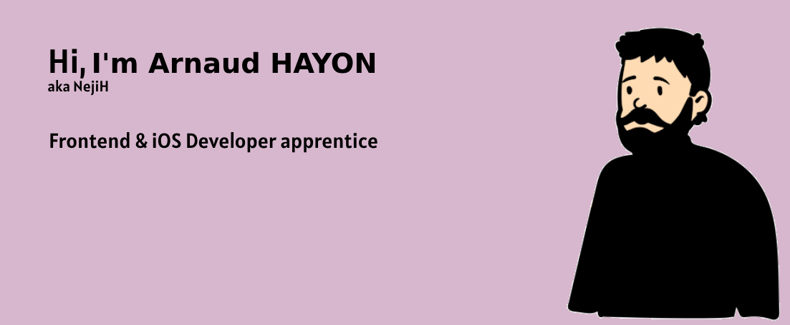

Here are a few things to know about me: 🔭 I’m currently student at the Ada Tech School in a fullstack cursus 🌱 I'm very interested in knowing more how to create accessibility driven and environmentally responsible apps 👯 I’m looking for an apprentice role in frontend or iOS programming ⚡ I've already worked with JavaScript HTML CSS Vite.js and MySQL 📚I'm currently learning Swift SwiftUI and TailwindCSS

### Let's connect:

### Languages and Tools:

</a>

